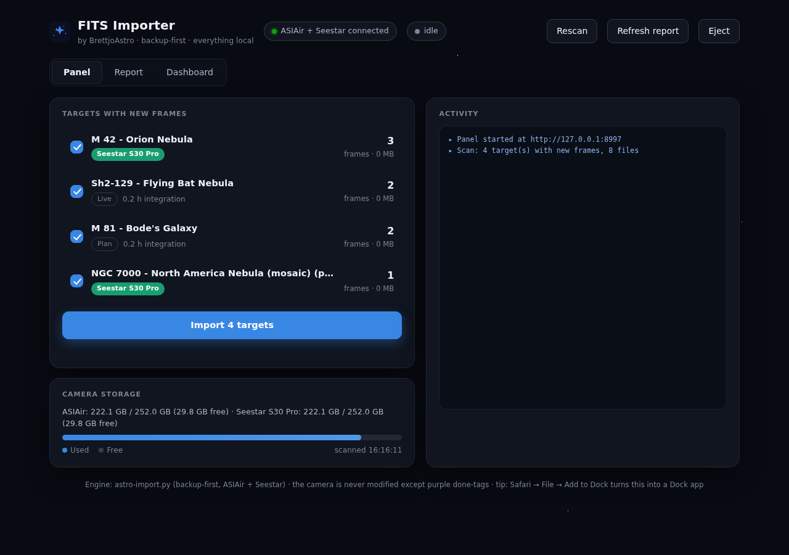

# BrettjoAstro FITS Importer

**Backup-first imports for ZWO ASIAir and Seestar smart telescopes — every frame verified to the byte, every session remembered forever.**



Plug in either camera (or both). A notification fires, a local control panel opens, and every new frame is copied with cryptographic proof it arrived intact. A lifetime ledger remembers everything you have ever imported — so archiving finished targets never causes re-imports, and the tool can tell you, honestly, what is safe to delete from a camera and what is not.

Built by [Brett Johnson](https://github.com/Brettjo77) for a ZWO ASI585MC Air (Askar FRA400 + Askar 107PHQ), a Seestar S30 Pro, an original Seestar S30, and a Seestar S50 Pro — and generalised so it works on any **Mac or Windows 11 PC** (from 1.5.0: one codebase, one version, the same capabilities on both — see [PARITY.md](PARITY.md)). First light: 686 frames imported, SHA-256-verified, and safely cleared from the camera in a single run.

**New here? Read [How it works — in plain English](HOW-IT-WORKS.md)** — the whole logic in astronomer's language, no code anywhere.

---

## Why this exists

Smart telescopes fill up fast, and hand-copying folders leaves you guessing. Most import scripts just copy — they cannot *prove* anything arrived intact, they forget everything once you archive a target, and their "delete the source?" prompts are a leap of faith. This tool inverts that: **nothing is ever marked imported unless the bytes on your Mac provably match the camera, and nothing is ever offered for deletion unless every file in the folder passes that test.**

## What it does

**For both cameras**

- Notices a camera the moment it's plugged in (macOS: a LaunchAgent watching `/Volumes`; Windows: a small watcher started at logon that recognises a camera drive by what's on it), scans read-only, notifies you, and opens the control panel at `http://127.0.0.1:8765`
- Verified copies: stream-hash from camera → write to `.partial` → fsync → re-read from disk → re-hash → rename. Interrupted copies leave a `.partial`, never a fake backup
- One JSON ledger for every frame ever imported (SHA-256, exposure, night, scope, day number, device) — entries are never deleted, so history survives archiving
- Day-folder numbering per target with night-continuation handling, shared display-name tables (catalogue → common names) plus your own custom names
- A backup report that separates *verified* / *backed up but unverified* / *still on camera only*, and a self-contained HTML status dashboard
- AstroLog-compatible JSON receipts per telescope after each import

**The control panel**

- One-page app layout: the page never scrolls; the target list, activity log, and report panes scroll inside their own cards, with camera storage as a live meter in the header
- **Calibration pairings up front**: the scan runs the real matching gates and shows which bias/dark/flat *sets* pair with which target — each pairing pre-ticked, untickable, so the import runs without interrupting you; only genuinely questionable pairings still ask (and the question names the set, its date and rotation versus your lights')
- **"Where files will land"**: a live destination tree showing the exact Day folders and calibration links the import will create — computed by the same code the import uses, updating as you tick and untick
- Targets and the backed-up inventory in date order, newest first, with last-shot dates
- Scope badges read the *incoming* frames' focal length, so a target shot on two rigs is labelled by tonight's, not its history
- An unmissable finish: green completion banner (frames, targets, duration), tab title flip, and a macOS notification with a chime for imports that end while you're elsewhere

**ZWO ASIAir**

- Per-scope recognition from FITS focal length; filename-parsed metadata with FITS fallback (including no-filter and mosaic-panel filename forms)
- A calibration library that ingests **all** darks/flats/biases from `Autorun/`, then hard-links the *matching* set (gain, filter, focal length, rotator angle, exposure) into each session's folder — and asks first when flats look like they belong to a different optical configuration
- `--set-filter "<target>" "<filter>" [--night YYYY-MM-DD]` records the true glass for sessions where the ASIAir app's filter field was left blank (filenames carry no token)
- The ASIAir is treated as a **backup of record**: this tool never deletes from it, ever

**Seestar (S30 Pro / original S30 / S50 / S50 Pro)**

- Model detected from the FITS `CREATOR` header, one vote per project folder (with an S50-only-mode-folder fallback) — each camera gets its **own** folder tree, its own per-target day numbering, and its own presence tracking, so two Seestars shooting the same nebula keep two clean stories. Pro variants are recognised *before* their base models, whatever the header's spacing or case, so an S50 Pro can never be misfiled as an S50 — and a volume carrying **mixed** or **unrecognised** identities refuses to import at all rather than guess (the ledger never forgets, so it must never memorise a wrong camera)
- Anything in MyWorks the tool does not understand is **loudly reported** — panel, report, and watcher all say "on camera, NOT backed up by this tool" instead of pretending everything is safe; a second mounted Seestar is announced too (one camera at a time)
- Interrupted imports resume into the **same night's** Day folder — a yanked cable costs you a replug, not a fragmented library (and `--merge-days` / `--renumber-day` exist to tidy history if it ever needs it); Milky Way sessions follow the same rule
- **Stack-only projects import too** (sub-frame saving is off by default on Seestars): a project folder holding just `Stacked_*.fit` + JPG goes through the normal path — display naming, one stack per stacking session, verified JPG alongside
- **Per-sub JPEG previews** (the S50 Pro writes one beside every sub) are *not* imported: a preview whose FIT twin is proven is not data (1.4.2). A JPEG with no FIT beside it is the only copy of whatever it shows: it is reported as "not handled" rather than ignored, keeps its folder out of SAFE, and can be binned with *discard…*. `SEESTAR_IMPORT_SUB_JPEGS=1` restores import-as-rider
- **Discard**: delete a Seestar target, mosaic panel set or mode folder (or one night of it) from the camera *without* importing it — typed DISCARD confirmation, never the ASIAir, and every file fingerprinted into the ledger as *never backed up* before it goes. Only never-backed-up files are ever offered: if everything is already backed up it hands over to the ordinary SAFE clear, and on a mix (tonight's three cloudy frames on a target whose earlier nights are imported, or stray JPEGs) it offers exactly the never-backed-up files and leaves the rest
- A stack the camera **re-saved after a session** (the S50 Pro annotates on shutdown) is detected by the ledger and re-copied atomically, re-verified — the Mac never quietly keeps stale stack bytes
- The S50 Pro's wide-angle camera pairs Milky Way sessions like the S30 Pro's; any *other* wide-camera output the firmware may write will surface as "NOT handled" until it has been seen in the wild — the tool names what it can't read rather than guessing
- Full MyWorks semantics: `_sub` light frames into Day folders (one Day per observing night), one `Stacked_N` kept per stacking *session* — a later, higher stack of the same exposure and filter continues an earlier one; a filter change or a restarted stack is its own keeper — never pruned, `_mosaic_pt` panels into `panels/`, `(mosaic)` display suffixes
- Simultaneous **Milky Way captures auto-pair** to the DSO session shot at the same moment, renamed and filed under the DSO's display name
- S50-family (S50 / S50 Pro) Lunar / Solar / Planetary / Scenery photo and video import
- SAFE-aware cleanup: after an import — or any time, from **clear…** on a row the panel shows as backed up — it offers to clear source folders **only** when every single file in them is ledger-verified *for that camera* and unchanged since import — *every* file (the one exception: a JPEG preview whose FIT twin is proven) — with No as the default. After your Yes it checks the camera and every file **again** and deletes only what passed; clearing flags only that camera's own ledger entries. Each Seestar's ledger rows are its own, so two units shooting the same target in the same second never share one

## Install

**On Windows 11**: download the ZIP, unzip it, double-click **Install on Windows.cmd** — the step-by-step is in [INSTALL.md](INSTALL.md#windows-11). The rest of this section is for the Mac.

Requires macOS, Python 3, and `astropy`. **Install Python from
[python.org](https://www.python.org/downloads/)** (then
`/usr/local/bin/python3 -m pip install astropy`) — see the permissions
section for why Apple's bundled Python is not enough.

**The easiest route**: click the green **Code** button above →
**Download ZIP** → unzip it (usually lands in Downloads) → open Terminal
(press ⌘-Space, type *Terminal*, press Return) and paste this one line:

```bash
bash ~/Downloads/brettjoastro-fits-importer-main/install-scripts.sh
```

(Browser downloads strip the "double-clickable" permission from scripts, so
the one paste is more reliable than clicking the installer — though the
`Install … .command` file works too once you right-click → Open it.)

**The git route:**

```bash
git clone https://github.com/Brettjo77/brettjoastro-fits-importer.git
cd brettjoastro-fits-importer
bash install-scripts.sh
```

Either way, the installer copies the engine, panel, and watcher to `~/bin`, installs and ad-hoc-signs the app wrapper into `~/Applications`, puts a one-double-click **Restart FITS Importer** button on your Desktop, installs a single LaunchAgent (with your `$HOME` substituted), and prints the first-run steps. Then just plug a camera in.

## macOS permissions — read this once, save a week

USB camera drives are "removable volumes", and macOS gates background access
to them per-process. Three hard-won facts:

1. **Apple's `/usr/bin/python3` is a "platform binary"** — from a background
   (launchd) launch it is *silently denied* removable-volume access and is
   never allowed to show the permission prompt. No Settings toggle reliably
   fixes this. That's why this project prefers python.org Python: it is
   ordinary signed software, so macOS simply **asks** — click Allow once and
   the hands-free flow (plug in → notification → panel → green scan) is
   permanent, reboots included.
2. **Terminal-launched processes inherit Terminal's grant**, which is why
   `Restart FITS Importer.command` on your Desktop always works, whatever
   else is going on. It is the guaranteed fallback.
3. The **app wrapper** (`BrettjoAstro FITS Importer.app`, ad-hoc signed by
   the installer) gives the panel a stable identity you can also grant Full
   Disk Access to by dragging it into System Settings → Privacy & Security —
   useful belt-and-braces, but unsigned apps' grants can go stale, which is
   why signing matters and the installer does it for you.

If a background-started panel ever logs `Operation not permitted`, the log
line itself names the exact thing to grant — or just use the Desktop button.

### First run

Plug a camera in: the panel opens, scans (reading only) and lists everything
as new. Tick what you want and press **Import** — the first import starts the
ledger and backs everything up, verified byte for byte. That's all most people
need.

**Only if you already have copies of these files on this Mac** (from another
tool, or by hand), don't let everything count as "new":

```bash
python3 ~/bin/astro-import.py --scan-only   # read-only: what does it see?
python3 ~/bin/astro-import.py --report      # read-only: how does it categorise?
python3 ~/bin/astro-import.py --baseline    # existing camera files join the ledger WITHOUT copying
python3 ~/bin/astro-import.py --reconcile   # SHA-verifies camera ↔ disk while both copies exist
```

The baseline prints an audit listing any target with no local copy; `--unbaseline "<target>"` un-marks those (keeping anything reconcile proved) so a real import picks them up.

## Configuration

Defaults put everything under `~/Documents/Astro/`. To relocate anything, copy
[`config.example.json`](config.example.json) to
`~/Library/Application Support/Astro Import/config.json` and edit. Precedence:
environment variable → `config.json` → built-in default. The installer never
overwrites an existing config.

## Optional: keeping a PC archive in sync (1.4.0)

**Skip this section unless you also keep an archive on another computer.**
Nothing here is installed or run until you configure it (`ASTRO_ARCHIVE_URL`
in `config.json`); the step-by-step is in [PC-SYNC.md](PC-SYNC.md).

In the author's setup the Mac takes frames off the cameras and holds the ledger,
and the archive of record lives on a Windows PC (`E:\Astro Image Data`), shared
over SMB and mounted on the Mac at `/Volumes/AstroImageData`. Three things keep
the two in step, none of which you run by hand:

1. **After every import** the engine ships what just arrived to the archive if
   the share is mounted (`--no-ship` to skip). `--ship` on its own does the same
   for anything waiting; `--ship --dry-run` shows the plan.
2. **Twice a day** (09:00 and 21:00) the `com.brettjohnson.astro-ship` LaunchAgent
   runs `--ship`. With `ASTRO_ARCHIVE_URL` set in `config.json` the engine asks
   Finder to mount the share on demand, using the password saved in the keychain,
   so no permanent connection is needed.
3. **On the PC**, `pc\sweep.ps1` (a scheduled task from `pc\install_sweep.ps1`)
   re-hashes every shipped file in a fresh process and writes
   `_verify\verified.jsonl`. The Mac reads it on the next ship and stamps
   `archiveVerifiedAt`. Only that stamp means a frame is safe in two places.

The archive's naming and Day numbering always win: existing targets are
reused, a night that already has a Day folder is merged into it, a new night
takes the next number. Nothing is ever deleted or overwritten on either side;
a differing file on the archive is reported and left alone. Set
`ASTRO_ARCHIVE_MOUNT` in `config.json` if the share mounts somewhere else.

## Safety model

- The ASIAir is never modified (apart from optional "done" Finder tags). The Seestar is only ever cleared by the SAFE clear — every file proven backed up and verified, checked again at the moment of deletion, after your explicit Yes — or by a discard you asked for and confirmed by typing DISCARD, which fingerprints every file into the ledger first. Nothing is ever deleted from your Mac or the archive by an import
- An empty scan never clears ledger flags (a half-mounted drive can't fake "files vanished"), and each camera's scan can only ever touch its own entries
- A concurrency lock (atomically created, with stale-PID detection) stops two imports colliding — the panel's Report takes the same lock, so a report save can never race an import
- The panel server answers **only** its own page: a non-local Host, any Origin other than exactly `http://127.0.0.1:<its port>` (another localhost port included), non-JSON bodies and requests without the per-launch token the page carries are all refused; it can't be framed by another site; and every answer names the question it answers — the first answer wins, so neither a stale click nor a double click can land on the wrong card
- The ledger is plain JSON written with fsync-then-atomic-rename (and recovered loudly from its `.bak` if it is ever unreadable), history is an append-only JSONL log, and a published mirror folder keeps browsable copies of both plus the dashboard and last report — **point the mirror at an iCloud folder** (one line in config.json) and the tool's memory survives a full machine rebuild

## CLI reference

The panel covers day-to-day use; everything is also scriptable:

| Command | What it does |
|---|---|
| `--scan-only` | Read-only scan, machine-readable tagged output (used by the watcher) |
| `--report` | The backup report: safe-to-clear / unverified / new, per camera |
| `--baseline` | Mark everything currently on the camera(s) as imported, without copying |
| `--reconcile` | Upgrade baseline entries to *verified* by SHA-comparing camera ↔ disk |
| `--verify [--deep]` | Re-check imported files on disk (size, or full re-hash with `--deep`) |
| `--pick` | Native picker dialog for choosing targets (Terminal fallback flow) |
| `--dashboard` | Regenerate and open the HTML status dashboard |
| `--ship [--dry-run]` | File verified frames into the PC archive over the mounted share; quiet when it is not mounted |
| `--tidy-stacks [--dry-run]` | List archived Seestar stacks that a later stack of the same session continues, and offer removal (typed DELETE) |
| `--refresh-metadata` | Back-fill ledger metadata after parser improvements (safe, repeatable) |
| `--set-filter "<target>" "<filter>"` | Record the true filter for a target's ASIAir frames (`--night` to limit; `none` clears) |
| `--discard "<folder or target>" [--night YYYY-MM-DD] [--reason "…"] [--dry-run]` | Delete never-backed-up Seestar files from the camera without importing (typed DISCARD; recorded in the ledger) |
| `--skip-target` / `--unskip-target` | Never-import list management (the panel's **import again** undoes it too) |
| `--export-settings [FILE]` / `--import-settings FILE` | Carry custom names, the never-import list and the scope table to your other computer (never the ledger) |
| `--version` | The one version number, and which platform this is |
| `--unbaseline <target>` | Remove *unverified* baseline entries so files count as new again |
| `--dry-run` | Everything printed, nothing written |
| `--targets A B` | Restrict an import to specific targets |

## Testing

495 end-to-end checks run the real engine and the real panel against simulated cameras (hand-built minimal FITS files, every device layout, crash/rename/mosaic/Milky-Way/cleanup/consent/interruption/multi-Seestar scenarios — including that the destination preview must equal the folders the import then actually creates, that a folder holding any unproven file is never offered as SAFE, and that the panel refuses foreign-origin requests):

```bash
python3 test_v2.py     # 375 engine checks (chain W1 simulates the Windows drive layer)
python3 test_app.py    # 120 panel checks (boots the real HTTP server)
# on Windows:  py -3 -X utf8 selftest.py   then the two suites above with  py -3 -X utf8
```

## Project layout

```
HOW-IT-WORKS.md                      the logic in plain English (start here)
INSTALL.md                           installing and updating, step by step
PC-SYNC.md                           optional: shipping to an archive on another computer
PARITY.md                            how the Mac and Windows editions stay identical
CHANGELOG.md                         what changed, release by release
Install … .command                   double-click installer (the no-terminal route)
astro-import.py                      the engine (all cameras, ledger, report, dashboard)
astro-app.py                         the control panel (localhost:8765)
astro-watch.sh                       drive watcher (one for both cameras)
BrettjoAstro FITS Importer.app/      app wrapper — the panel's grantable macOS identity
Restart FITS Importer.command        Desktop one-click restart (Terminal context)
com.brettjohnson.astro-import.plist  LaunchAgent template ($HOME substituted on install)
com.brettjohnson.astro-ship.plist    optional twice-daily ship agent (only with an archive configured)
pc/                                  the PC side of PC-SYNC.md (PowerShell sweep)
Install on Windows.cmd               Windows: double-click to install or update
install-windows.ps1                  Windows installer (no admin rights needed)
astro-watch.py                       Windows camera watcher (started at logon)
selftest.py                          install check (Mac and Windows)
install-scripts.sh                   installer / updater
config.example.json                  optional path overrides
test_v2.py · test_app.py · test_env_helper.py
docs/                                the website (GitHub Pages: Settings → Pages → /docs)
```

## License

[MIT](LICENSE) © 2026 Brett Johnson. Built with [Claude](https://claude.com/claude-code).

*FITS = Flexible Image Transport System — the astronomy standard since 1981. This tool treats every one of yours as irreplaceable.*
